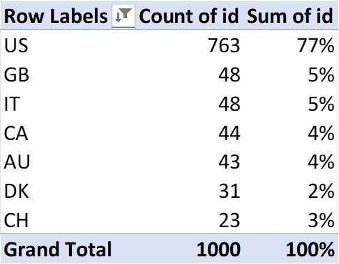

# Crowdfunding-Analysis
Conclusions about crowdfunding campaign:
•	Outcome is considered ‘Successful’ if the percent funded is equal to or greater than 100%. Outcome is considered ‘Failed’ if the percent funded is less than or in some cases equal to 100%. Note: There are 4 cases of 100% funded and Successful and 3 cases of 100% funded and Failed
•	33% of successful projects came from plays which are a subcategory in theater category. 
•	Maximum number of successful outcomes are in the Goal range of 1000 - 4999

* Limitations of the dataset: If comparison must be made for data, it must be in uniform units. Here the currency column is in different currencies and a conversion factor for a standard currency is to be provided as we are analyzing everything from the amount raised to what the goal amount is.
Significance or the definition of columns like staff_pick, spotlight column is missing.

* Possible tables and what additional information it will give:
An analysis of the number of countries which participated in the campaigning can be done with maximum participation from US contributing to 77% can be drawn from the data provided. 
 

* Conclusions for statistical Analysis:
For the crowdfunding data the median better summarizes the data for both successful and failed outcomes as the values are more spread-out with the min and maximums are in two ends of the spectrum, the median tells how many numbers of backers are making the project a success or a failure.

* The variability of the data is more in successful outcomes this is based on the more standard  deviation value compared to the failed outcome.

